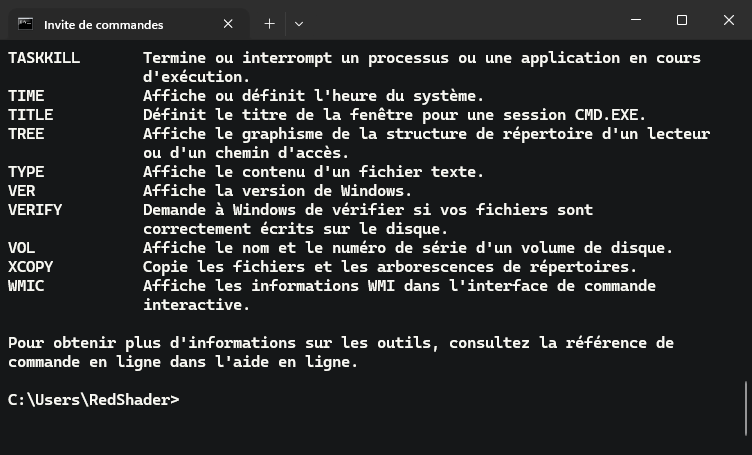

# 📋 Liste des commandes pratiques de CMD

## 📜 Introduction

L’invite de commande (cmd.exe) est un interpréteur de commandes pour les systèmes d’exploitation Windows qui permet aux utilisateurs d’exécuter des commandes et des scripts à partir d’une interface en ligne de commande. Il est souvent utilisé pour effectuer des tâches de maintenance système, telles que la gestion de fichiers et de dossiers, la configuration du réseau et la résolution des problèmes. La disponibilité des commande cmd.exe dépendent de la version de Windows. Ici, je ne vais donner les commandes disponibles qu'à partir de Windows 10 et Windows 11.

## 📁 Système de fichiers

1. **CD** ou **CHDIR**  
    Cette commande permet de se déplacer dans l'arborescence.  
    `CD chemin du répertoire` : Se déplace vers le répertoire spécifié.  
    `CD ..` : Permet de remonter dans l'arboresence.  
    `CD \` : Se déplace au début de l'arborescence.  
    `CD /D D:\` ou `D:` : Change de lecteur vers le lecteur spécifié.

2. **DIR**  
    Affiche le contenu d'un répertoire.  
    `DIR` : Affiche le contenu du répertoire courant.  
    `DIR dossier` : Affiche le contenu du répertoire du répertoire spécifié.

3. **MD** ou **MKDIR**  
    Cette commande permet la création d'un ou plusieurs répertoires.  
    `MD dossier` : Création d'un dossier.  
    `MD dossier1 dossier2 dossier3` : Création de plusieurs dossier.

4. **RD** ou **RMDIR**  
   Cette commande permet la suppression de répertoire vide (ou non vide avec `/S`).  
    `RD dossier` : Supprime un dossier vide.  
    `RD /S dossier` : Supprime un dossier non vide.

5. **COPY**  
    Permet la copie de fichiers.  
    `COPY .\fichier.txt ..\Desktop\fichier.txt /V` : Copie un fichier avec vérification (`/V`).

6. **XCOPY**  
    Permet la copie de fichier et de dossiers.  
    `XCOPY /I /S A:\ B:\` : Copie les fichiers et les dossiers du lecteur `A:` vers le lecteur `B:`. Le paramètre /I va créer le répertoire de destination si il n'existe pas. Le paramètre /S spécifie de copier tous les fichiers et répertoires sauf ceux vides.  

7. **MOVE**  
    Permet de déplacer ou renommer un fichier ou un dossier.  
    `MOVE fichier1 fichier2` : Renomme `fichier1` en `fichier2`.

8. **DEL**  
    Permet la suppression d'un ou plusieurs fichiers.  
    `DEL fichier1 fichier2 fichier3` : Supprimer les fichiers spécifiés.  
    `DEL *.ext` : Supprime les fichiers dont l'extension à été spécifié.  

9. **REN**  
    Permet de renommer les fichiers et les dossiers.  
    `REN fichier1 fichier2` : Renomme `fichier1` en `fichier2`.

10. **TYPE**  
    Permet d'afficher le contenu d'un fichier texte (`.txt`, `.csv`, `.xml`, etc...).  
    `TYPE rapport.log` : Affiche le contenu de `rapport.log`.

11. **TREE**  
    Permet d'afficher graphiquement la structure de dossiers d’un lecteur ou d’un chemin.  
    `TREE` : Affiche les répertoires uniquement.  
    `TREE /F` : Affiche les répertoires et les fichiers.  
    `TREE /A` : Force l'utilisation de caractères ASCII.

12. **COMP**  
    Permet de comparer deux fichiers.  
    `COMP fichier1.txt fichier2.txt /L` : Compare deux fichiers texte et affiche les numéros de lignes.  

13. **FC**  
    Permet de comparer deux fichiers ou ensembles de fichiers et d'afficher les différences entre eux.  
    `FC fichier1 fichier2` : Compare les deux fichiers spécifié.  

14. **MKLINK**  
    Permet de créer un lien symbolique.  
    `MKLINK <Lien> <Cible>` : Créer un lien symbolique d'un fichier vers une cible.  
    `MKLINK /D <Lien> <Cible>` : Créer un lien symbolique d'un répertoire vers une cible.  
    `MKLINK /H <Lien> <Cible>` : Créer un lien physique vers une cible, cela permet d'avoir copie exact d'un fichier qui va garder un lien avec le fichier d'origine. Les modifications de l'un va se répercuter vers l'autre.  
    `MKLINK /J <Lien> <Cible>` : Créer une jonction d'un répertoire vers une cible.

    > ℹ️ Note : Les paramètres `/D` et `/J` donne le même résultat mais `/J` offre plus de compatibilité avec les logiciels.

15. **FIND**  
    Permet de chercher une chaine de caractère dans un fichier ou une sortie.  
    `FIND /N "<Chaine>" <fichier>` : Recherche la chaine spécifié dans le fichier spécifié. Le paramètre `/N` affiche les numéros de ligne.  

16. **FINDSTR**  
    Permet de chercher une chaine de caractère dans un fichier ou une sortie.  
    `FINDSTR <Chaine> <fichier>` : Recherche la chaine spécifié dans le fichier spécifié. Le paramètre `/N` affiche les numéros de ligne.  
    `FINDSTR /S /I <Chaine> *.*` : Recherche la chaine spécifié dans les fichiers du répertoire et les sous-répertoire selon l'extensions de fichier spécifié.  

17. **MORE**  
    Affiche les sorties écran par écran. Permet aussi d'afficher le contenu d'un fichier texte.  
    `MORE <Fichier>` : Affiche le contenu du fichier spécifié.  
    `CHKDSK /? | MORE /C /E` : Affiche la sortie de la commande (ici l'aide de la commande `CHKDSK`) et l'affiche page par page. Il faut appuyer sur la touche espace pour faire défiler les pages, ou entré pour faire du ligne par ligne. `/C`permet d'effacer l'écran avant l'affichage.  

18. **CLS**  
    Efface l'écran.
    `CLS`

19. **EXIT**  
    Quitte le programme ou le script.  
    `EXIT`

20. **SORT**  
    Permet de trier le texte d'une commande ou d'un fichier.  
    `SORT <fichier1> > <fichier2>` : Trie le contenu du fichier 1 et place le résultat dans le fichier 2.  Le paramètre `/R` permet d'inverser le sens du tris.  

21. **TYPE**  
    Affiche le contenu d'un ou plusieurs fichiers textes.  
    `TYPE <fichier>` : Affiche le contenu du fichier spécifié.  

22. **ERASE**  
    Supprime un ou plusieurs fichiers.  
    `ERASE <fichier>` : Supprime le fichier spécifié.  

## 🧑‍💻 Utilisateurs

1. **NET USER**  
   Permet de gérer les utilisateurs.  
   `NET USER <nom d'utilisateur> <mot de passe> /ADD` : Permet d'ajouter l'utilisateur spécifié avec le mot de passe.  
   `NET USER <nom d'utilisateur> <mot de passe>` : Remplace le mot de passe actuel par le mot de passe spécifié.  
   `NET USER <nom d'utilisateur> /DELETE` : Permet de supprimer l'utilisateur spécifié.  
   `NET USER <nom d'utilisateur> /ACTIVE:<choix>` : Permet d'activer ou de désactiver un compte utilisateur. Il faut choisir entre `YES`et `NO`.  

2. **NET LOCALGROUP**  
   Permet de gérer les groupes.  
   `NET LOCALGROUP <nom du groupe> /ADD` : Ajoute le groupe spécifié.  
   `NET LOCALGROUP <nom du groupe> /DELETE` : Supprime le groupe spécifié.  
   `NET LOCALGROUP <nom du groupe> <nom d'utilisateur> /ADD` : Ajoute l'utilisateur au groupe spécifié. Il est possible de spécifier plusieurs utilisateurs à ajouter au groupe.  
   `NET LOCALGROUP <nom du groupe> <nom d'utilisateur>` : Change le groupe de l'utilisateur selon de le groupe spécifié.  
   `NET LOCALGROUP <nom du groupe> <nom d'utilisateur> /DELETE` : Supprime l'utilisateur spécifié du groupe. Il est aussi possible de spécifier plusieurs utilisateurs.  

## 💻 Système

1. **CHKDSK**  
    Permet de vérifier l'état d'un disque.  
    `CHKDSK C:` : Affiche l'état du disque.  
    `CHKDSK /F C:` : Affiche et corrige l'état du disque.  
    `CHKDSK /R C:` : Localise les secteurs défectueux.  

2. **DOSKEY**  
    Permet de créer des macros pour exécuter une ou plusieurs commandes.  
    `DOSKEY LS=DIR` : Créer une macro qui permet d'éxecuter la commande `DIR` avec la macro `LS`.

3. **CLIP**  
    Permet de rediriger la sortie d'une commande dans le presse-papier.  
    `DIR | CLIP` : Copie le résultat de la commande `DIR` vers le presse-papier.  
    `CLIP < README.md` : Copie le contenu du fichier dans le presse-papier.  

4. **VER**  
    Permet d'afficher la version de Windows.  
    `VER`

5. **ASSOC**  
    Permet d'afficher ou de modifier les associations des extensions de fichiers.  
    `ASSOC` : Affiche toutes les association des extensions de fichiers.  
    `ASSOC .txt` : Affiche l'association du type de fichier `.txt`.  
    `ASSOC .log=txtfile` / Associe `.log` au type de fichier texte.  
    `ASSOC .log=` : Supprime l'association de l'extension `.log` (il faut ajouter un esapce après le =).  

6. **FTYPE**  
    Affiche ou modifie les types de fichiers utilisés dans les associations d’extension de fichiers.  
    `FTYPE txtfile=C:\Windows\System32\notepad.exe "%1"` : Spécifie le bloc-note comme programme par défaut pour l'ouverture des fichiers de type texte.  

7. **ATTRIB**  
    Permet d'afficher, de définir ou de supprimer les attribus de lecture seule, d'archivage, système et masqué assignés aux fichiers et répertoires.  
    `ATTRIB +R fichier.txt` : Ajoute (+) l'attribut de lecture seul au fichier.  
    `ATTRIB -R fichier.txt` : Supprime (-) l'attribut de lecture seul au fichier.  

    Liste des attributs
    | Attribut | Description |
    | --- | --- |
    | `R` | Lecture seule |
    | `A` | Archive |
    | `S` | Système |
    | `H` | Masqué |
    | `I` | Contenu non indexé |

8. **CIPHER**  
    Permet le chiffrement des fichiers et des répertoires sur un volume **NTFS** (donc non disponible sur les autres systèmes de fichier).  
    `CIPHER` + fichier ou répertoire : Affiche l'état de chiffre du fichier ou du dossier spécifié.  
    `CIPHER /E` + fichier ou répertoire : Chiffre le fichier ou le dossier spécifié.  
    `CIPHER /D` + fichier ou répertoire : Déchiffre le fichier ou le dossier spécifié.  
    `CIPHER /C` + fichier ou répertoire : Affiche les informations de chiffrement sur+ le fichier ou le dossier spécifié.  
    `CIPHER /S:<répertoire>` : Chiffre le contenu du répertoire et des sous-répertoires.  

9. **COMPACT**  
    Affiche ou modifie la compression de fichiers sur les partitions NTFS.  
    `COMPACT /C /S` : Compresse le contenu du dossier et des sous-dossier où l'on se trouve.  
    `COMPACT /C` + fichier ou dossier : Compresse le fichier spécifié.  

    L'ajout du paramètre `/EXE:<Algorithmes>` permet de spécifier l'algorithme à utiliser.

    *Les algorithmes*  

    | Algorithme | Description |
    | --- | --- |
    | `XPRESS4K` | Valeur la plus rapide et la valeur par défaut |
    | `XPRESS8K` |  |
    | `XPRESS16K` |  |
    | `LZX` | Le plus compact |

10. **CHCP**  
    Permet d'afficher et de modifier la page de code.  
    `CHCP` : Affiche la page de code actuelle.  
    `CHCP 65001` : Défini la page de code sur le numéro spécifié (ici `65001`correspond à UTF-8).  

11. **DATE**  
    Permet d'afficher et de modifier la date.
    `DATE` : Affiche la date et propose de la modifier.  
    `DATE /T` : Affiche la date mais ne propose pas de la modifier.  

12. **TASKLIST**  
    La commande tasklist est utilisée pour afficher une liste des tâches en cours d’exécution sur un ordinateur.  
    `TASKLIST /V` : Affiche la liste des processus avec leur détails.  

13. **TASKKILL**  
    La commande taskkill est utilisée pour arrêter un processus en cours d’exécution sur un ordinateur.  
    `TASKKILL /F /IM wordpad.exe /T` : Force la femeture du processus spécifié.

14. **SYSTEMINFO**  
    La commande systeminfo est utilisée pour afficher des informations détaillées sur la configuration système et les paramètres du système d’exploitation.  
    `SYSTEMINFO /FO LIST` : Affiche les information système au format liste.  

15. **DRIVERQUERY**  
    La commande driverquery est utilisée pour afficher une liste des pilotes installés sur un ordinateur.  
    `DRIVERQUERY /FO TABLE` : Affiche la liste des pilotes au format tableau.  

16. **POWERCFG**  
    La commande powercfg est utilisée pour gérer les options d’alimentation du système.

17. **SCHTASKS**  
    La commande schtasks est utilisée pour voir et planifier des tâches à exécuter à une heure ou une date ultérieure.

18. **LOGOFF**  
    Permet de fermer une session.  
    `LOGOFF` : Ferme la session courante.  
    `LOGOFF` + id de session : Ferme la session dont l'id est spécifié.

19. **SHUTDOWN**  
    Cette commande permet d'éteindre l'ordinateur.  
    `/R` : Redémarrage.  
    `/S` : Arrêt.  
    `/O` : Combiné avec `R` permet l'accès aux options de récuprération de Windows.  

20. **REGEDIT**  
    Cette commande est utilisée pour afficher et modifier les paramètres du registre Windows.

21. **SFC**  
    Cette commande permet la vérification et la réparation des fichiers système (/SCANNOW).  

22. **RUNAS**  
    Permet à un utilisateur d'exécuter une commande ou des programmes avec des autorisations différentes que celles attribuées à son compte utilisateur.  
    `RUNAS /USER:<Administrateur> DISKPART` : Lance DISKPART avec le compte administrateur (il est possible spécifier n'importe quel compte utilisateur).  

23. **SET**  
    Affiche, fixe ou supprime des variables d’environnement de cmd.exe.  
    `SET projet=C:\Projet` : Créer une variable d'environnement temporaire nommé projet. Elle est accessible en écrivant `%projet%`.  

24. **SUBST**  
    Associe un chemin à une lettre de lecteur.  
    `SUBST <lettre> <emplacement>` : Défini une lettre à un emplacement défini pour créer un lecteur virtuel.  
    `SUBST <lettre> /D` : Supprime le lecteur virtuel.  

25. **TZUTIL**  
    Permet d'afficher et de modifier le fuseau horaire de Windows.  
    `TZUTIL /G`: Affiche le fuseau horaire actuel.  
    `TZUTIL /L` : Affiche la liste des fuseaux horaires.
    `TZUTIL /S <id du fuseau>` : Défini le fuseau. Celui de Paris est `Romance Standard Time`.  

## 🌍 Réseau et internet

1. **IPCONFIG**

    Cette commande permet d'afficher les informations détaillé sur la configuration IP de la carte réseau de l'ordinateur. Cette commande permet aussi de libérer et de renouveler l'adresse IP de l'ordinateur.  
    `/ALL` : Affiche toutes les informations de condifuration.  
    `/RELEASE` : Libère l'adresse IPv4 pour la carte spécifiée.  
    `/RENEW` : Renouvelle l'adresse IPv4 de la carte spécifié.  
    `/FLUSHDNS` : Purge le cache de résolution DNS.  
    `/REGISTERDNS` : Actualise tous les baux DHCP et réenregistre les noms DNS.  

2. **PING**

    Cette commande permet de tester l'accessibilité d'un périphérique sur le réseau (comme un ordinateurn un serveur ou une imprimante).  
    `PING` + nom de l'hôte ou adresse IP.

3. **TRACERT**

    Cette commande permet de déterminer l'itinéraire vers une adresse IP ou d'un nom d'hôte. Cela permet de connaitre en détails le chemin parcouru par le paquets ICMP.  
    `TRACERT` + nom d'hôte ou adresse IP.  

4. **NETSTAT**

    Cette commande permet d'afficher les connexions réseau actives et les statistiques de réseau associées. Elle peut être utilisée pour afficher les connexions TCP/IP actives et les ports sur lesquels l’ordinateur local est à l’écoute.  
    `NETSTAT -A` : Affiche toutes les connexions et tous les ports d'écoute.  
    `NETSTAT -B` : Affiche l'exécutable impliqué dans la création de chaque connexion ou port d'écoute.

5. **NSLOOKUP**  
    Cette commande permet d'effectuer une recherche DNS (Domain Name System) pour trouver l’adresse IP d’un nom d’hôte ou le nom d’hôte correspondant à une adresse IP. Elle peut également être utilisée pour afficher des informations sur les serveurs DNS et les enregistrements DNS associés.

    `nslookup <domaine>` : Trouve l'enregistrement du nom de domaine spécifié.  

6. **ARP**  
    Affiche et modifie les tables de traduction d'adresses IP en adresses physiques utilis�es par le protocole de r�solution d'adresses ARP.  
    `ARP -A` : Affiche les tables de cache ARP pour toutes les interfaces.  
    `ARP -D <ip>` : Efface une entrée de cache ARP spécifié.  
    `ARP -S <ip> <mac>` : Ajoute une entrée de cache ARP avec l'adresse spécifié.  

7. **ROUTE**  
    La commande route est utilisée pour afficher et modifier la table de routage IP utilisée par le système d’exploitation pour déterminer le chemin que les paquets IP doivent emprunter pour atteindre leur destination.

8. **NETSH**  
    Cette commande est utilisée pour configurer et afficher les paramètres réseau.

9. **FTP**  
    Transfère des fichiers vers et depuis un ordinateur avec un service de serveur FTP activé.  
    `FTP ftp.bobpony.com` : Permet de se connecter sur le serveur FTP spécifié.  

10. **GETMAC**  
    Cet outil permet à un administrateur d’afficher l’adresse
    MAC des cartes réseaux d’un ordinateur.  
    `GETMAC /V` : Affiche les les adresses MAC de l'ordinateur avec les détails (`/V).  

11. **HOSTNAME**  
    Affiche ke nom de l'hôte actuel.  

12. **NBTSTAT**  
    Affiche les statistiques du protocole et les connexions TCP/IP actuelles utilisant NBT (NetBIOS sur TCP/IP).  
    `NBTSTAT /a <nom>` : Affiche la table de noms NetBIOS d’un ordinateur distant en spécifiant le nom NetBIOS.  
    `NBTSTAT /A <ip>` : Affiche la table de noms NetBIOS d'un ordinateur distant en spécifiabt son IP.  

13. **NET USE**  
    Permet de connecter et déconnecter des lecteurs réseau.  
    `NET USE <lettre>: \\<chemin UNC> /USER:<nom d'utilisateur> <mot de passe>` : Connecte un lecteur réseau. Le paramètre `/USER`spécifie le nom d'utilisateur et son mot de passe si le partage le demande.  
    `NET USE <lettre>: /DELETE` : Déconnecte le lecteur réseau selon la lettre spécifié.  Remplacer la lettre par `*` déconnecte tous les lecteurs réseau.  

## 💽 Disques et partitions

1. **DISKPART**  
    Cette commande est utilisée pour gérer les disques et les partitions.  
    Plus de détails [ici](../Diskpart.md)

2. **CHKDSK**  
    Cette commande permet de vérifier l’intégrité du système de fichiers et des disques durs.
