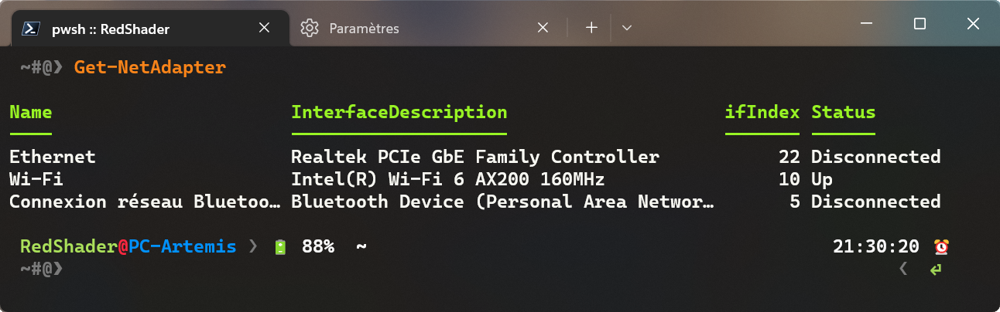

# 🛠️ Configuration IP avec PowerShell

Il est possible de voir, modifier ou supprimer la configuration IP de son ordinateur avec PowerShell.

## 📌 Choisir l'interface réseau

Avant de commancer, on doit récupérer l'index ou le nom de l'interface à laquelle on veut changer l'adresse IP. Il existe deux commande qui permettent d'obtenir cette information, les voici :  

```powershell
Get-NetIPInterface
```

ou  

```powershell
Get-NetAdapter
```

Voici un exemple de ce qu'on obtient :



## 📌 Ajout d'une adresse IP

Pour changer ajouter une adresse IP à une interface, il faut tapper la commande :  

```powershell
New-NetIPAddress –InterfaceIndex n –IPAddress 192.168.1.100 –PrefixLength 24 –DefaultGateway 192.168.1.1
```

> ℹ️ La commande ci-dessus va ajouter l'adresse 192.168.1.100 à l'interface n. Le numéro d'interface est à récuppérer avec les commandes `NetIPInterface` ou `Get-NetAdapter`. Pour renseigner le masque de sous-réseau, il faut fournir le masque en notation CIDR (/8, /16, /24 pour les masques par défauts). Si l'adresse est configuré via DHCP, cela va le désactiver dans le système.

## 📌 Suppression d'une adresse IP

Pour supprimer une adresse IP, il faut taper la commande :  

```powershell
Remove-NetIPAddress –InterfaceIndex n –IPAddress 192.168.1.100 –PrefixLength 24 –DefaultGateway 192.168.1.1
```

> ℹ️ La commande va demander une confirmation

## 📌 Activer ou désactiver la configuration DHCP

Pour activer ou désactiver le DHCP, il faut taper la commande :  

```powershell
Set-NetIPInterface -InterfaceIndex n -Dhcp Enabled
```

ou

```powershell
Set-NetIPInterface -InterfaceIndex n -Dhcp Disabled
```

## 📌 Définir l'adresse du DNS

Pour définir l'adresse du DNS, il faut récupérer, soit l'index de l'interface, soit le nom de l'interface. Pour ce faire, il faut utiliser la commande ci-dessous :  

```powershell
Get-DnsClientServerAddress
```

Ensuite, il faut entrer la commande là pour définir l'adresse DNS de l'interface réseau désiré :

```powershell
Set-DnsClientServerAddress -InterfaceIndex n -ServerAdress ("adresse primaire", "adresse secondaire")
```

## 📌 Supprimer l'adresse du DNS

Pour supprimer une adresse DNS statique, il faut ajouter l'argument `-ResetServerAddresses` à la commande `Set-DnsClientServerAddress` :  

```powershell
Set-DnsClientServerAddress -InterfaceIndex n -ResetServerAddresses
```
