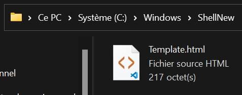
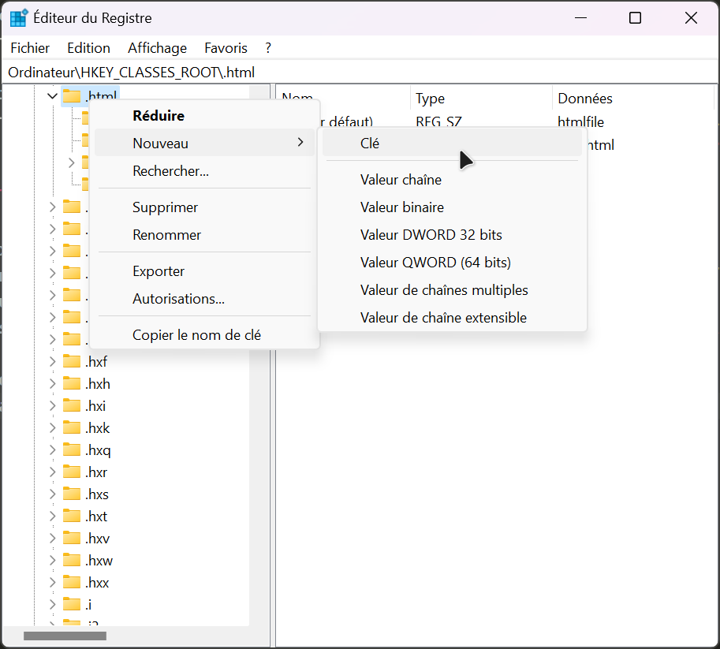
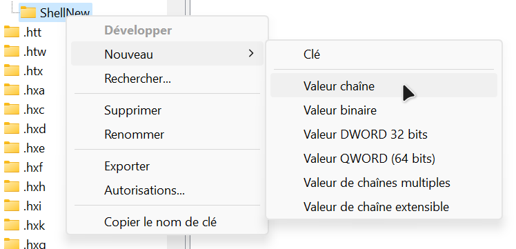
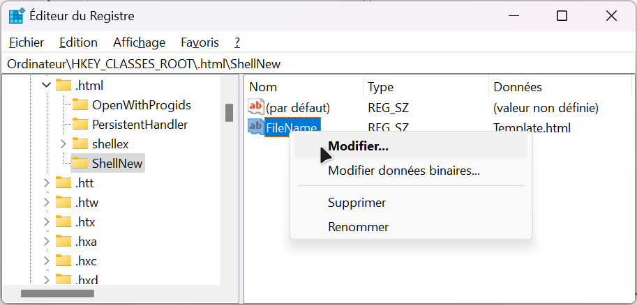
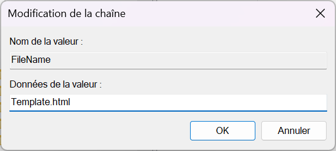
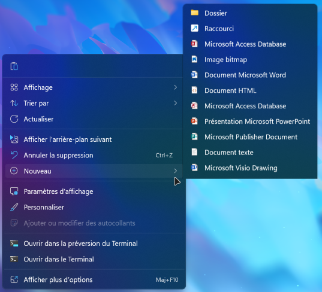

# 🛠️ Ajout d'un type de fichier dans "Nouveau" du menu contextuel

Dans Windows, on peut créer un fichier directement depuis le menu contextuel avec l'option "Nouveau" qui affiche un sous-menu avec une liste de fichier.  
Il est possible d'ajouter un type de fichier dans ce menu. Voici comment faire :  

1. Création du dossier ShellNew  
    Il faut commencer par ce rendre à l'emplacement `C:\Windows\` puis créer le dossier `ShellNew`. Ce dossier va contenir les fichiers template que l'on veut ajouter au menu contextuel de Windows.  

2. Création du fichier template  
    Maintenant, il faut créer le fichier template. Le plus simple est de créer le fichier sur le bureau et ensuite le déplacer dans le dossier `ShellNew`. Le nom du fichier doit être `Template.ext` (***ext est l'extension du fichier***).  

    

3. Recherche de l'extension dans le registre
    Nous allons maintenant ajouter la clé dans le registre. Pour ce faire, il faut faire `🪟 + R`, ce qui va lancer la fenêtre exécuter. Il faut y tapper `regedit`.  
    Le registre va se lancer. Ouvrez le nœud `HKEY_CLASS_ROOT` puis rechercher l'extension du fichier à ajouter au menu.  

    > ⚠️ Penser à faire une sauvegarde de votre registre avant manipulation.

4. Ajout de la clé dans le registre  
    On peut maintenant créer la clé `ShellNew` sur l'entrée de l'extension.  

    

5. Ajout d'une `Valeur chaine` dans `ShellNew`  
    On va ajouter une `Valeur chaine` et lui donner le nom de  `FileName`.  

    

6. Modification de la `Valeur chaine`  
    On va modifier la valeur. Pour cela, il faut faire un clic droit sur `FileName` puis cliquer sur `Modifier`. Une fenêtre va alors s'ouvrir avec un champs de texte vide.  

    

7. Ajouter le nom de votre fichier template.  
    On va maintenant ajouter le nom du fichier (avec son extension) dans le champs de texte vide. Cela doit donner ceci :  

    

8. Redémarrer votre ordinateur.

