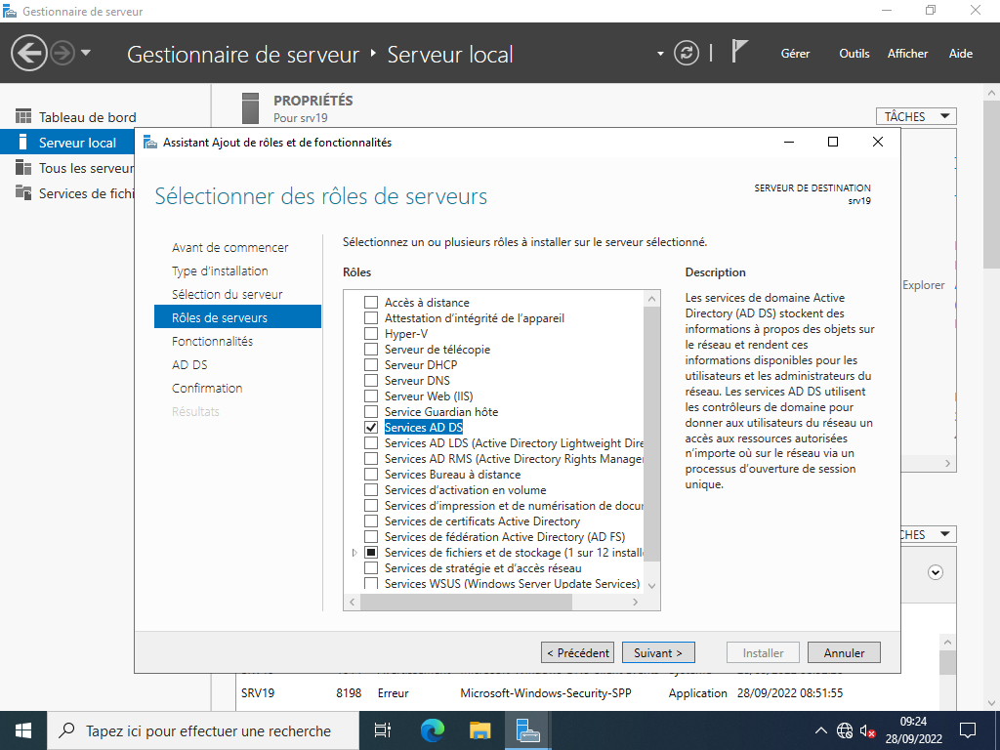
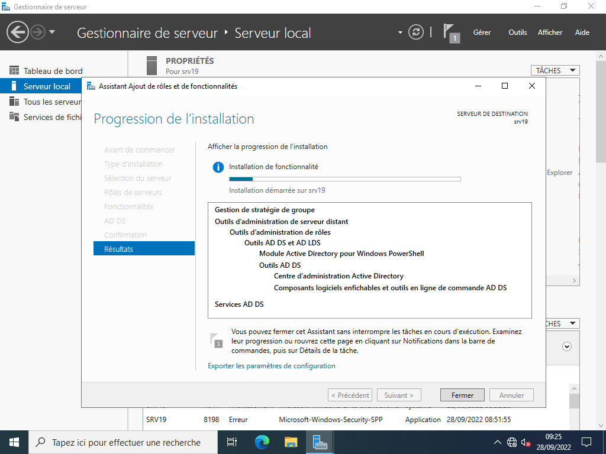
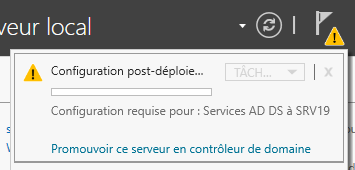
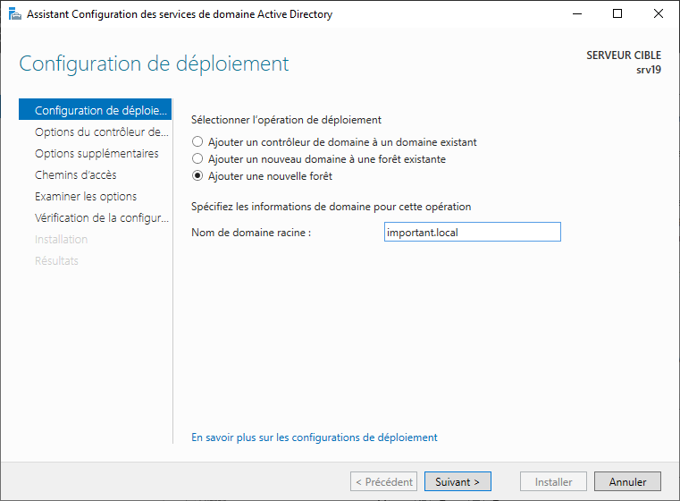
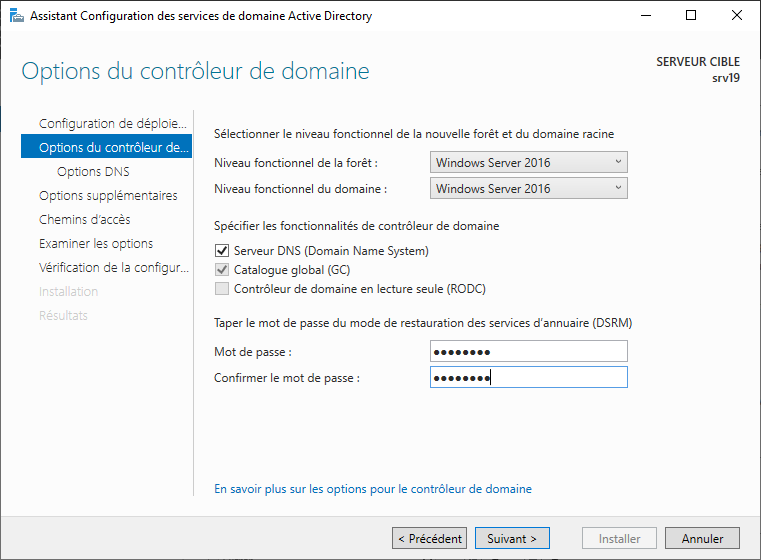
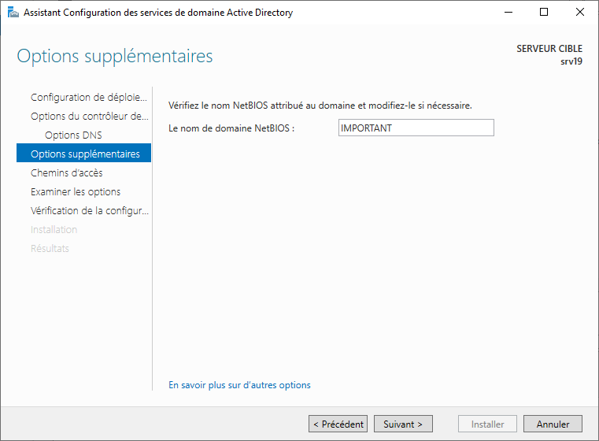
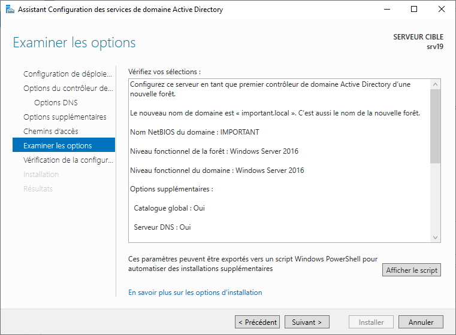
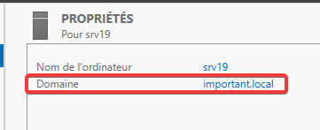

# Installation d'Active Directory

1. Dans un premier temps, nous allons dans `Assistant Ajout de rôles et de fonctionnalités` pour ajouter le rôle d'Active directory (`AD DS`, pas les autres). Valider la fenêtre suivante.
    > ℹ Une nouvelle fenêtre de `Assistant Ajout de rôles et de fonctionnalités` va apparaitre. Ne rien cocher et cliquer sur le bouton `Suivant`.  

    

2. Continuer jusqu'à la fenêtre d'installation.  

    

3. Après que l'installation soit fini, cliquer sur le point d'exclamation jaune en haut et cliquer sur `Promouvoir ce serveur en contrôleur de domaine AD DS`.  

    

4. Cliquer sur `Ajouter une nouvelle forêt` puis saisisser un nom (dans le modèle `mondomaine.ext`).  

    

5. Entrer un mot de passer et laisser le niveau fonctionnel sur `Windows Server 2016`. Continuer dans la configuration.  

    

6. Vérifier le nom netbios. Continuer l'installation.  

    

7. Au moment d'arriver sur les chemins d'accès, ne changer rien.  
8. Vérifier la configuration avant d'installer.  

    

9. Cliquer sur `Ìnstaller`. La machine va ensuite redémarrer pour terminer l'installation. Vous pouvez vérifier ensuite que le domaine est bien actif dans le gestionnaire de serveur.  
    > ℹ Domaine doit avoir remplacé le groupe de travail.  

    
