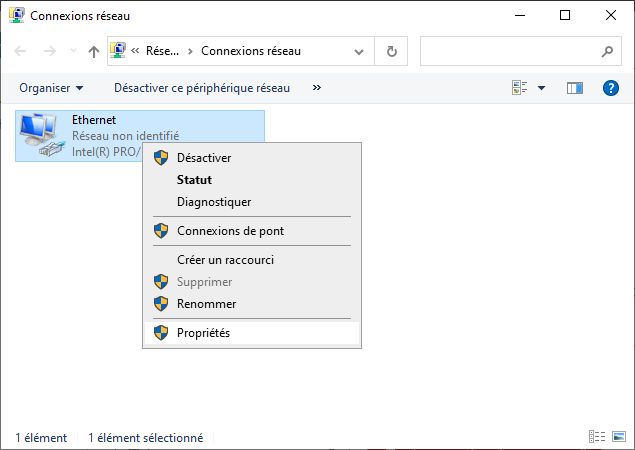
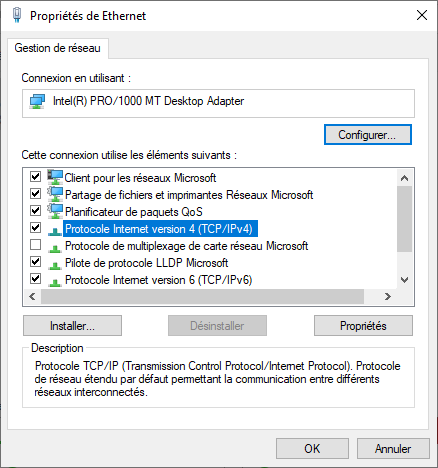
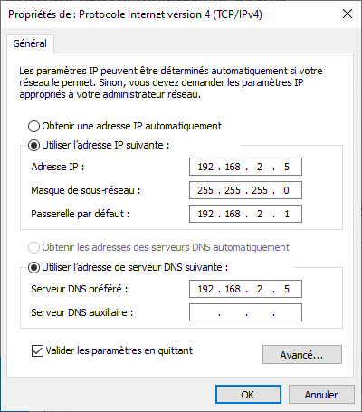
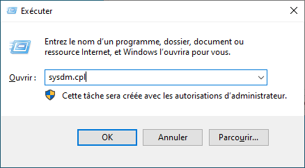
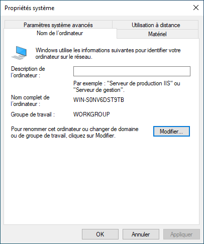
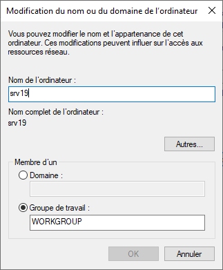
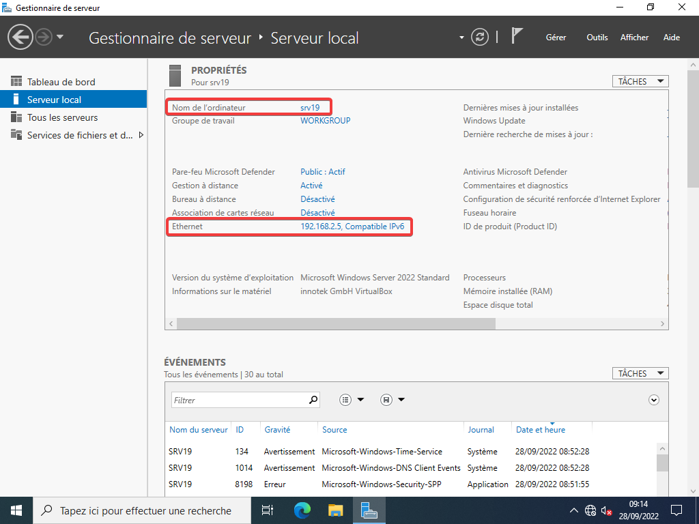

# 🛠 Configuration de base

1. [Installation de Windows Server](./Installation.md)
2. ***Configuration de base***
3. [Active Directory](./ActiveDirectory.md)
4. [Le DHCP](./DHCP.md)

___

Cet article à pour but d'expliquer la configuration de base en vu d'y installer Active Directory et le DHCP.  

Dans un premier temps, après l'ouverture de session cette fenêtre va apparaitre. Il s'agit du gestionnaire de serveur. Le but de cette fenêtre est de permettre un accès rapide aux fonctions essentielles du serveur. C'est ici que l'on va y ajouter des rôles, comme Active Directory.  

1. On va commencer par changer son adresse IP. Comme il s'agit d'un serveur, son IP doit être fixe. Vous devez ouvrir le programme exécuter avec `🪟 + CTRL`. Saisissez `ncpa.cpl` dans la fenêtre.  

    

2. Dans la fenêtre qui s'ouvre, faite un clic droit sur l'interface réseau (très souvent Ethernet). Cliquer sur propriété.  

    

3. Une fenêtre comme celle-ci va s'ouvrir. Cliquer sur ``Protocole Internet version 4 (TCP/IPv4), puis sur le bouton `Propriétés` en dessous.  

    

4. Dans la fenêtre, coché `Utiliser l'adresse IP suivante :`, puis taper vos paramètres IP. Une fois cela fait, cocher la case `Valider les paramètres en quittant`. Vous pouvez ensuite fermer la fenêtre.  
    > ℹ Il est possible de Windows vous dise après avoir fermé la fenêtre que votre DNS ne réponde pas. C'est normal, il n'est pas encore configuré.  

    

5. On va maintenant modifier le nom du système, pour cela, faite `🪟 + CTRL`. Taper `sysdm.cpl`.  

    

6. Une fenêtre s'affiche. Cliquer sur le bouton `Modifier`.  

    

7. Une fenêtre s'affiche, vous pouvez changer le nom et fermer la fenêtre.  
    > ℹ Vous devez redémarrer l'ordinateur pour appliquer le changement de nom.  

    

8. Vous pouvez vérifier que vos modifications ont bien été prise en compte dans le gestionnaire de serveur.  

    
