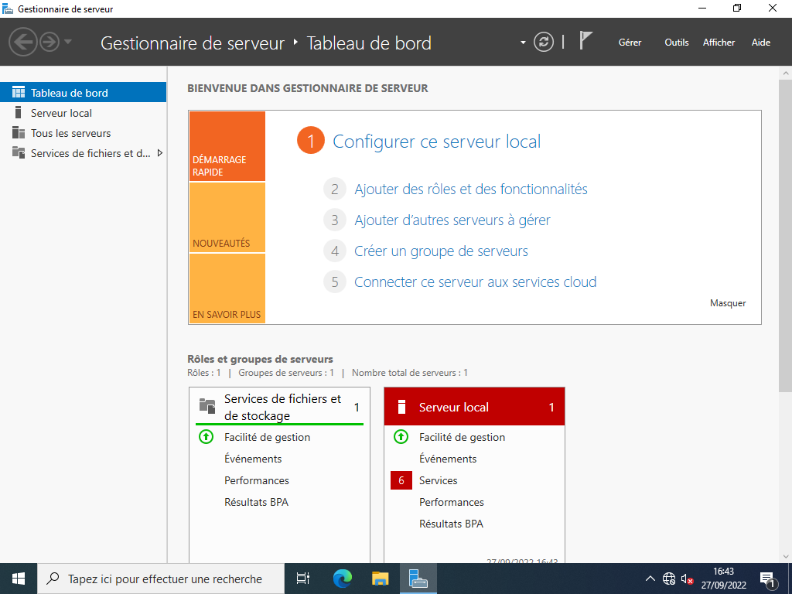
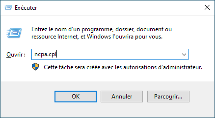

# 🛠 Configuration de base

1. [Installation de Windows Server](./Installation.md)
2. ***Configuration de base***
3. [Active Directory](./ActiveDirectory.md)
4. [Le DHCP](./DHCP.md)

___

Cet article à pour but d'expliquer la configuration de base en vu d'y installer Active Directory et le DHCP.

Dans un premier temps, après l'ouverture de session cette fenêtre va apparaitre. Il s'agit du gestionnaire de serveur. Le but de cette fenêtre est de permettre un accès rapide aux fonctions essentielles du serveur. C'est ici que l'on va y ajouter des rôles, comme Active Directory.  

1. On va commencer par changer son adresse IP. Comme il s'agit d'un serveur, son IP doit être fixe. Vous devez ouvrir le programme exécuter avec `Win + CTRL`.  

    
