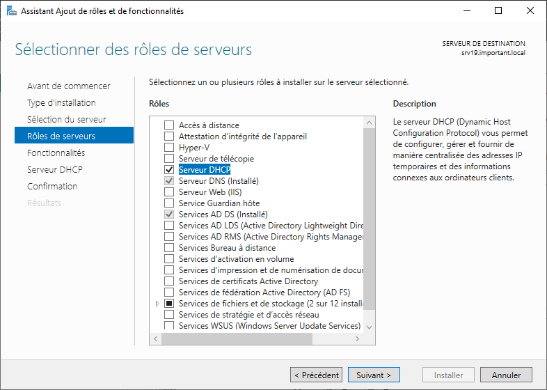
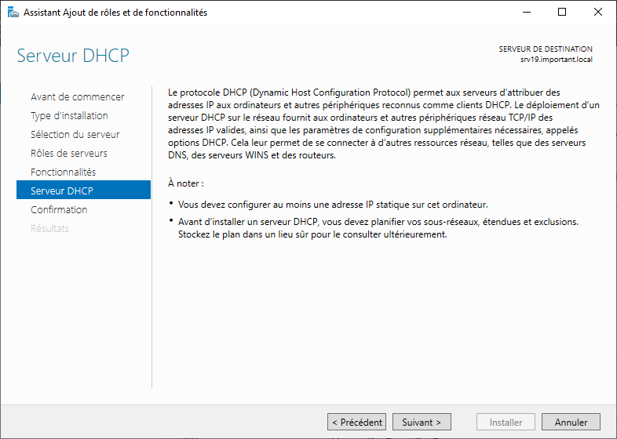

# Configutation du DHCP

La configuration du DHCP va permettre au sevreur de distriburer les adresses ip selon la configuration que l'on aura donné. Cette partie doit se faire *après* la configuration d'Active Directory !  

1. Dans un premier temps, il faut installer la fonctionnalité via l'`Assistant Ajout de rôles et de fonctionnalités`. Valider la fenêtre qui va apparaitr et cliquer sur `Suivant`.  

       > ℹ Une nouvelle fenêtre de `Assistant Ajout de rôles et de fonctionnalités` va apparaitre. Ne rien cocher et cliquer sur le bouton `Suivant`.  

    

2. Faire suivant et vérifier les informations. Il est important que le serveur ai une adresse IP fixe avant de continuer.  

    

3. Une fenêtre de récapitulatif va s'afficher. Vous pouvez installer le rôle DHCP. Cela va prendre quelques minutes.

4. Une fois cela fait, il faut configurer le rôle DHCP.
