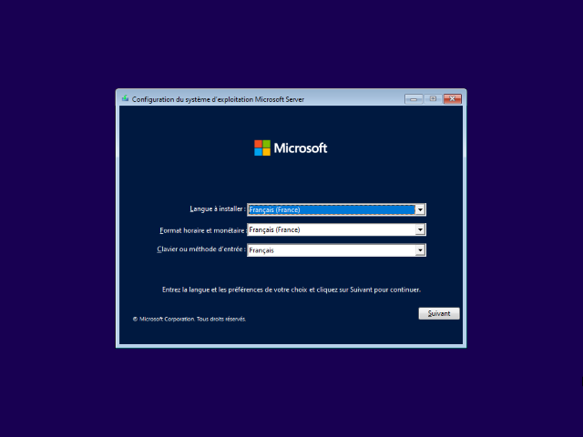
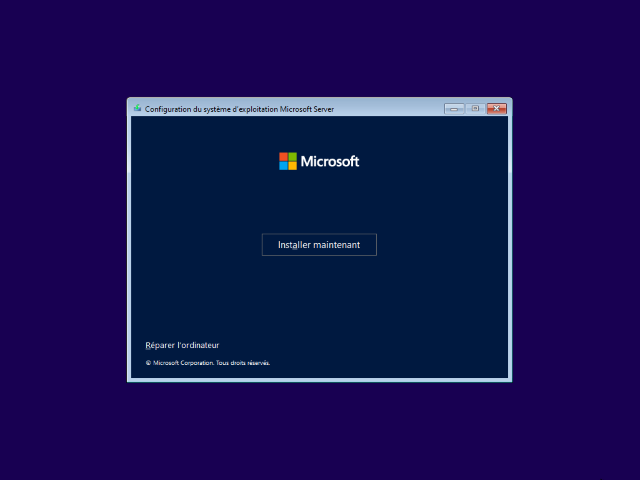
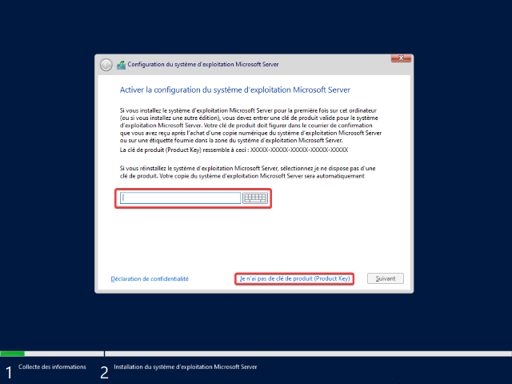
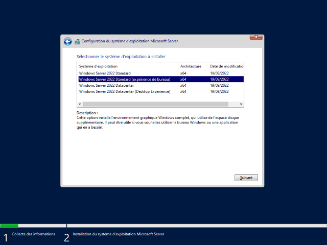
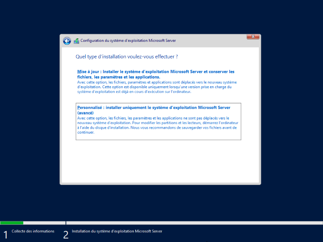
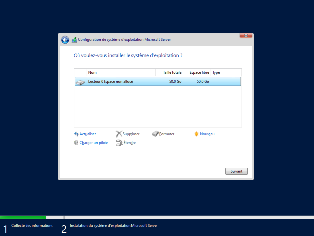
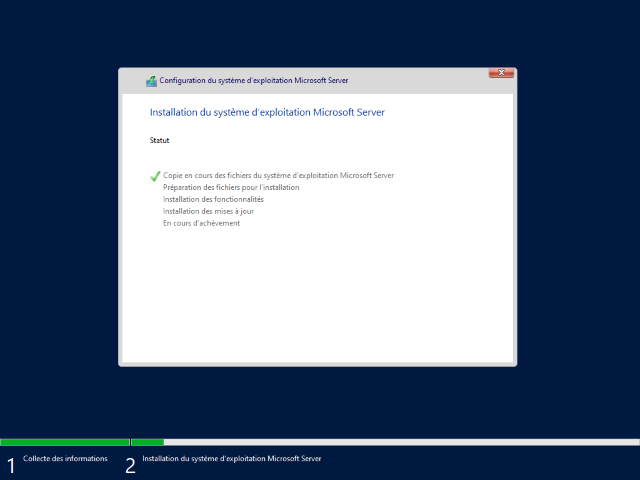
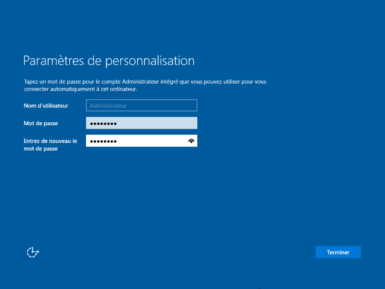
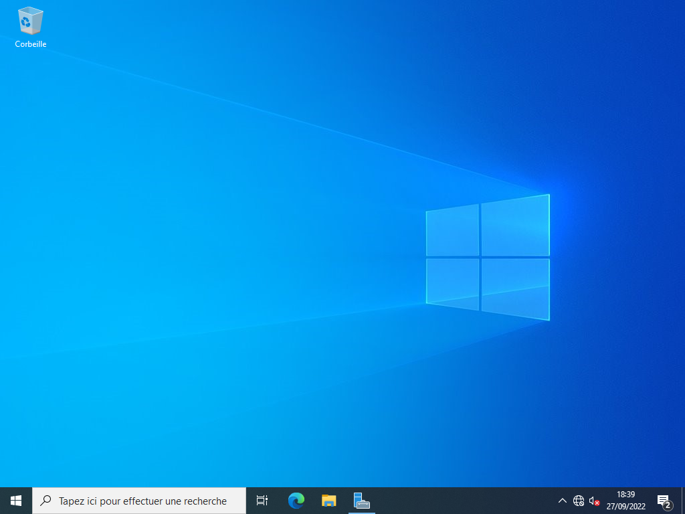

# Installation de Windows Serveur 2022

Sommaire :  

1. ***Installation de Windows Server***
2. [Configuration de base](./ConfigurationBase.md)
3. [Active Directory](./ActiveDirectory.md)
4. [Le DHCP](./DHCP.md)

Cet article va traiter de l'installation de Windows Server 2022.  

1. Selectionner la langue, le format horaire et monétaire ainsi que la clavier.  
    > ℹ Selectionner la bonne configuration avant l'installation.

    

2. Une fenêtre va apparaitre pour commencer l'installation.  

    

3. Une fenêtre va vous demander de saisir une clé de licence. Saisissez là ou cliquer sur le lien en bas pour passer cette étape (dans ce cas, Windows sera activé pour 180 jours).

    

4. Une fenêtre va vous demander de sélectionner l'édition à installer (Si vous n'avez pas entré de clé de licence). Selectionner la bonne version.  
    > ℹ En selectionnant Expérience de bureau, Windows Server va installer les éléments du bureau Windows habituel (comme le bureau, le bloc-note, le navigateur internet,etc...)

    

5. Cliquer sur `Personnalisé : Installer uniquement le système d'exploitation Microsoft Server (avancé)`

    

6. Selectionner le bon disque ou la bonne partition. Vous pouvez directement en créer depuis cette interface via le bouton `☀ Nouveau`

    

7. L'installation ce lance. Vous devrez patientez quelque minutes (selon la configuration de votre serveur).
    > ℹ Windows va redémarrer automatiquement après cette étape.  

    

8. Après le redémarrage, Windows va afficher un écran pour la création du mot de passe du compte Administrateur par défaut.

    

9. La confiuration est terminé, vous pouvez vous connecter à Windows Server.  
   > ℹ Ne pas oublier de faire les mises à jour

    
